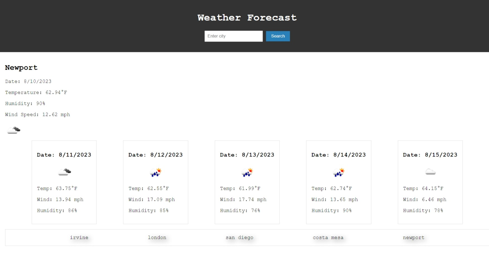

# Weather Forecast

Welcome to the Weather Forecast web application! This app allows you to quickly check the weather forecast for a specific city. You can view the current weather conditions and a 5-day forecast to help you plan ahead.

## Table of Contents

- [Description](#description)
- [User Experience](#user-experience)
- - [Search Form](#search-form)
- - [Current Weather](#current-weather)
- - [5-Day Forecast](#5-day-forecast)
- - [Search History](#search-history)
- [Installation](#installation)
- [Usage](#usage)
- [Technologies Used](#technologies-used)
- [Features](#features)
- [Deployment](#deployment)
- [Demo](#demo)
- [Contributors](#contributors)
- [Contact](#contact)
- [License](#license)

## Description

The Weather Forecast web application provides real-time weather information to help users stay informed about weather conditions in their chosen locations. It features a simple and intuitive interface that displays the current weather and a 5-day forecast, making it easy for users to plan their activities accordingly.

## User Experience

### Search Form

The main feature of the app is the search form located in the header. Users can input the name of the city they want to get the weather forecast for. Upon submitting the form, the app fetches and displays the weather data for the specified city.

### Current Weather

The "Current Weather" section displays essential information about the selected city's weather conditions. This includes the city name, date, temperature, humidity, wind speed, and an icon representing the weather status.

### 5-Day Forecast

The "5-Day Forecast" section provides a concise view of the weather forecast for the next five days. It includes information about temperature, wind speed, humidity, and weather icons for each day.

### Search History

The app also keeps track of the most recent searches users have performed. The "Search History" section allows users to quickly access weather data for previously searched cities.

## Installation

To run the Weather Forecast app locally, follow these steps:

1. Clone the repository: `git clone https://github.com/arsalanbardsiri/weather-forecast.git`
2. Navigate to the project directory: `cd weather-forecast`
3. Open the `index.html` file in your preferred web browser.

## Usage

- Open the Weather Forecast app in your web browser.
- Use the search form to enter the name of a city you want to get the weather forecast for.
- Click the "Search" button.
- View the current weather conditions and the 5-day forecast for the selected city.
- Access the search history to quickly retrieve weather data for previous searches.

## Technologies Used

The Weather Forecast app is built using the following technologies:

- HTML 
- CSS 
- JavaScript 
- [OpenWeatherMap API](https://openweathermap.org/api) - Provides weather data

## Features

- Real-time weather information
- Current weather conditions display
- 5-day weather forecast
- Search history for quick access

## Deployment

The Weather Forecast app is deployed and accessible at: [URL](https://arsalanbardsiri.github.io/weather-forecast/)

## Demo

Here's a short demo showcasing the functionality of the Weather Forecast app:

## Contributors

This project was developed by [Arsalan Bardsiri](https://github.com/arsalanbardsiri).

## Contact

If you have any questions or suggestions regarding the Weather Forecast app, feel free to contact us:

- Email: arsalanbardsiri@gmail.com
- GitHub: [github.com/arsalanbardsiri](https://github.com/arsalanbardsiri)

## License

This project is licensed under the [MIT License](LICENSE).
